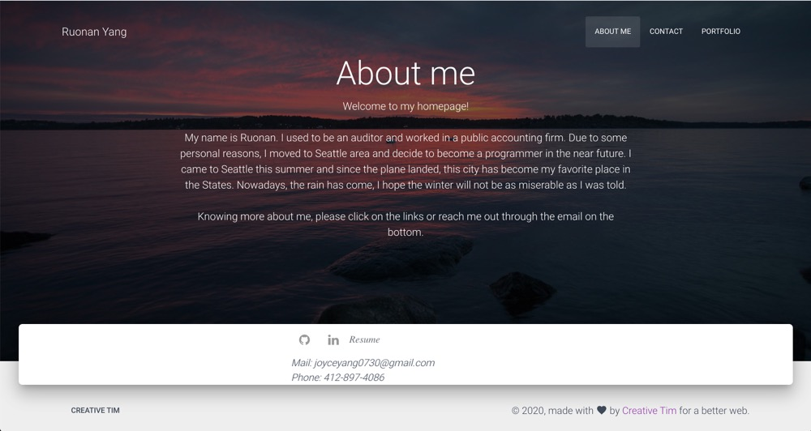

# homework-12-11
# Ruonan's Portfolio

## Description 

Build a professional portfolio site using HTML and CSS following a set of specifications and a style guide. AS a web developer I want a deployed portfolio so that I can showcase my applications to potential employers and clients.  

Using Bootstrap, recreate your portfolio site with the following items: 
A navbar 
A responsive layout 
Responsive images 
 

## Installation

Clone this repo

git clone https://github.com/rnyang-16/first-homework-rnyang.git

and open index.html in your favorite browser.

## Usage 

Open index.html in your favorite browser and click on whatever part that you are interested.

## Credits

https://github.com/microsoft/vscode 
https://guides.github.com/features/mastering-markdown/

## License

This project is licensed under the MIT License.

---
© 2019 Trilogy Education Services, a 2U, Inc. brand. All Rights Reserved.

